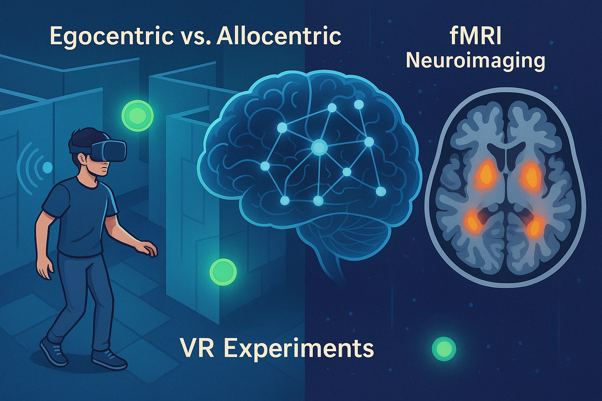

<!-- inline stylesheet for header accent + illustration -->

# Sun Terletsky‑Tsruya  
**PhD Student in Dr. Michal Ramot’s Lab**  
_Department of Brain Sciences_

<figure class="header-illustration">
  
  <figcaption>A schematic of our VR navigation task</figcaption>
</figure>

---

# Sun Terletsky‑Tsruya
**PhD Student in Dr. Michal Ramot’s Lab**  
_Department of Brain Sciences_

---

## Hello!
I’m a PhD student investigating how the human brain navigates and represents space.  
My research focuses on:

- **Egocentric vs. Allocentric Spatial Perception**  
  Disentangling self-centered and world-centered representations.
- **Virtual Reality (VR) Experiments**  
  Exploring how individuals encode and recall locations using auditory or visual cues.
- **Neuroimaging Techniques (fMRI)**  
  Revealing the neural networks underlying spatial cognition and memory.

---

## Current Projects
- **Sound Navigation in VR:** Testing pure egocentric encoding without visual cues.  
- **Perspective Taking / Spatial Orientation Tests:** Translating allocentric information to egocentric perspectives.

---

## Assignments
- **Python Course Repository:** This site also hosts my assignments.  
  [Assignments Folder](https://github.com/sunterlet/python-course-assignments)

---

## Contact
- **Email:** [sun.terletsky@weizmann.ac.il](mailto:sun.terletsky@weizmann.ac.il)  
- **GitHub:** [Sun Terletsky‑Tsruya](https://github.com/sunterlet)
